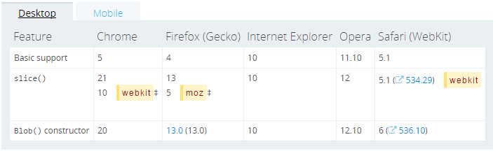

# 图片预览效果的实现

我实在是太懒了。。。貌似记得去年阿里有一个题就是实现图片预览的功能，现在决定好好看看。

方式1：百度。。。。
百度之后有了在下面的答案：
## IE内核下
```javascript
var imgObj = document.getByElementById("#image");
var view = document.getByElementById("#view");

var url = imgObj.value;
var imgElement = document.createElement("img");
imgElement.setAttribute("src",url);
view.appendChild(imgElement);
```

此时的url得到的是文件在本地的路径，比如我的路径就是：C:\Users\Public\Pictures\Sample Pictures\Penguins.jpg，然后把这个赋给src，就可以显示图片。但是同样的代码，在chrome下显示的url是 C:\fakepath\Chrysanthemum.jpg，显然不是一个图片在本地的真实路径。本来想看看chrome和IE在处理文件上传这部分的差异，但是百度不到相关的信息。只知道chrome浏览器出于安全性的考虑，并不会把文件的真实路径暴露出来，上面说的fakepath只是一个临时的文件路径。

## chrome等。。。

所以chrome下在获取URL的时候用下面的方法：
```javascript
var url = window.URL.createObjectURL(imgObj.files[0]);
```

那这又是怎么回事？imgObj.files里面放的是什么？在控制台输出：发现files是一个fileList，里面放的是file对象，file里面又包含了name文件名、size文件大小、type文件类型等信息。
输出url，得到的是blob:null/c55ac5b8-afab-481c-9114-b061a45eda95。这是什么？？
在MDN中我找到了答案。

> 一个Blob对象就是一个包含有只读原始数据的类文件对象，Blob对象中的数据并不一定
得是JavaScript中的原生形式，File接口是基于Blob，继承了Blob的功能，并且扩展支持了用户计算机上的本地文件。

然后在它下面的使用中，找到了我想要的东西。使用Blob对象可以创建一个对象URL，上面代码中，imgObj.files[0]是一个file对象，当然也是一个Blob对象，url就是创建的URL对象。

通过下面的方式将一个Blob对象转成一个对象URL
```javascript
var url = window.URL.createObjectURL(blob);
```
并且重要的话说三遍：
*我们可以像一个普通的URL那样使用它，比如用在img.src上*
*我们可以像一个普通的URL那样使用它，比如用在img.src上*
*我们可以像一个普通的URL那样使用它，比如用在img.src上*
恩，这样就知道是怎么回事了。

但是有个缺点是这个Blob对象在浏览器中兼容性不太好，尤其是在移动端的浏览器中。




## 其他处理方式
转载：[JS魔法堂之实战：纯前端的图片预览](http://www.cnblogs.com/fsjohnhuang/p/3925827.html)

作者在里面提到了FileReader的用法，FileReader是HTML5的一个用来处理Blob和File类型的数据。由于在低版本中html5的一些东西支持的不是很好，针对低版本的浏览器又提出了一些其他的方法。

### File Reader
浏览器支出：FF 3.6+， chrome 7+， IE 10+
```javascript
var fr = new FileReader();
fr.onload = function(evt) {
    var pvImg = new Image();
    pvImg.style.width = pv.offsetWidth + 'px';
    pvImg.style.height = pv.offsetHeight + 'px';
    pvImg.src = evt.target.result;
    pv.removeChild(0);
    pv.appendChild(pvImg);
};
fr.readAsDataURL(imgObj.files[0]);
```

### 低版本实现
```javascript
if (view.filters && typeof(viewv.filters.item) === 'function'){
    view.filters.item("DXImageTransform.Microsoft.AlphaImageLoader").src = docObj.value;
}
```